<p align="center">
  
</p>

<h1 align="center">pushback: how often do you correct your AI coding agent?</h1>

<p align="center">
  <a href="https://pypi.org/project/pushback/"></a>
  <a href="https://github.com/intikhab49/pushback/actions/workflows/ci.yml"></a>
  
  
  <a href="LICENSE"></a>
</p>

<p align="center">
  <a href="#results">Results</a> ·
  <a href="#quick-start">Quick start</a> ·
  <a href="#how-it-works">How it works</a> ·
  <a href="#turn-recurring-corrections-into-claudemd-rules">Rules</a> ·
  <a href="#export-your-corrections-as-preference-pairs">Preference pairs</a> ·
  <a href="#privacy">Privacy</a> ·
  <a href="#how-the-numbers-are-computed">Method</a>
</p>

`pushback` is a command-line tool that reads your **Claude Code transcripts** and
shows what you use your AI coding agent for, how often you correct it on each
kind of work (code, writing, media, research, ops, meta), and how often a
correction needs correcting again. It drafts
**CLAUDE.md rules** from the corrections you keep repeating, shows which of
your existing rules keep getting broken, and exports your corrections as
**preference pairs** (prompt / chosen / rejected). A hand-audit step tells you
how far to trust every number.

```
pip install pushback
```

## Results

The author's own 1,633 messages to Claude Code:

<p align="center">
  
</p>

| task | messages | share of use | corrections | rate | 95% CI | corrected again |
|---|---:|---:|---:|---:|---|---:|
| writing | 429 | 26% | 106 | 24.7% | 20.9%–29.0% | 41% (41/99) |
| code | 340 | 21% | 20 | 5.9% | 3.8%–8.9% | 11% (2/18) |
| meta | 297 | 18% | 14 | 4.7% | 2.8%–7.8% | 36% (5/14) |
| ops | 265 | 16% | 12 | 4.5% | 2.6%–7.7% | 8% (1/12) |
| research | 188 | 12% | 13 | 6.9% | 4.1%–11.5% | 8% (1/13) |
| media | 114 | 7% | 49 | 43.0% | 34.3%–52.2% | 44% (20/45) |

Most corrected topics (at least 5 messages each):

| topic | messages | corrections | rate | corrected again |
|---|---:|---:|---:|---:|
| writing / social-post | 135 | 47 | 35% | 23/45 |
| writing / client-message | 144 | 26 | 18% | 7/23 |
| media / image | 47 | 24 | 51% | 10/21 |
| media / video | 36 | 12 | 33% | 6/12 |
| writing / proposal-report | 26 | 11 | 42% | 5/11 |
| writing / video-script | 36 | 10 | 28% | 3/9 |
| code / frontend | 31 | 6 | 19% | 1/6 |
| code / debugging | 27 | 5 | 19% | 1/4 |

- Against 91 hand-checked messages the correction labels had **precision 0.97 and recall 0.80**. Topic labels were spot-checked, not audited.
- **1 in 3 corrections needed a second one.** 70 of 201 fixes got corrected again (35%), 41% on writing and 44% on images.
- **3 rules the author had already written kept getting broken**, with 6 to 8 corrections each.

> [!NOTE]
> These rates describe a workflow, not a model. The author's code work runs
> through skills, reference files, memory and a plan before the agent writes
> anything, and CI catches mistakes before a human has to. Writing got none of
> that. A low rate means the process around the agent is doing its job.

That's one person's logs. Run it on yours.

## Quick start

```bash
pip install pushback

pushback extract            # reads ~/.claude/projects, writes ./pushback-data/
pushback label              # labels each message with Claude (resumable)
pushback audit              # hand-check 40 messages
pushback report --markdown  # the table, with the audit folded in
pushback rules              # draft CLAUDE.md rules from your recurring corrections
pushback export             # your corrections as prompt/chosen/rejected pairs
```

`label` uses the Anthropic SDK, so it picks up `ANTHROPIC_API_KEY` or an
`ant auth login` profile. It defaults to `claude-opus-5` at low effort; change
it with `--model`. To send through a gateway, set `ANTHROPIC_BASE_URL`.

> [!TIP]
> **No API key?** Every step works without one:
> ```bash
> pushback label --prompt-file       # writes the labelling job as batch files
> # in Claude Code: "read <path it prints>/INSTRUCTIONS.md and follow it"
> pushback label --from-responses    # reads the answers back, with the same checks as the API path
> ```
> Your messages are still read by Claude, through Claude Code on your
> subscription. Unanswered or broken batches are listed and stay unlabelled.

| command | what it does | leaves your machine? |
|---|---|---|
| `extract` | pulls the messages you typed, plus full agent turns, out of transcripts | no |
| `label` | tags each message with a task, a topic and whether it's a correction | yes: to the API after asking, or through Claude Code with `--prompt-file` |
| `audit` | shows you a stratified sample to judge by hand | no |
| `report` | what you use the agent for, how often you correct it per task and per topic (frontend, cli-tool, social-post, ...), how often a fix gets corrected again, with 95% intervals | no |
| `rules` | groups recurring corrections into CLAUDE.md rules | yes, or no with `--prompt-file` |
| `export` | writes preference pairs as JSONL, with secrets scrubbed | no |

## How it works

<p align="center">
  
</p>

Every message gets a **task** (code, writing, media, research, ops, meta) and a
**topic** from a fixed list for that task, so results stay comparable between
people:

| task | topics |
|---|---|
| code | frontend, backend-api, cli-tool, database, tests, auth-security, integrations, data-ml, scripts-automation, agent-prompts, debugging, pr-workflow |
| writing | social-post, client-message, email, docs-readme, video-script, proposal-report, spec-plan |
| media | image, video, diagram, ui-design |
| research | benchmark-experiment, data-analysis, market-leads, paper-reading, trading-analysis |
| ops | deploy-hosting, git-github, accounts-credentials, config-settings, browser-automation, ci |
| meta | planning, memory-context, advice, status-check |

Anything that fits none of them is `other`.

A **correction** is a message where you reject, fix or redirect something the
agent just did, said, wrote or proposed. New tasks, answers to its questions,
picking between its options, approvals and pasted logs don't count. The full
rubric is in [`src/pushback/prompt.py`](src/pushback/prompt.py). If you change
it, run `audit` again.

Rejected tool calls and interrupts carry no text, so they're counted separately
and grouped by the action you stopped (a code edit, a shell command, and so on).

## Turn recurring corrections into CLAUDE.md rules

```bash
pushback rules                                  # drafts rules into pushback-data/rules.md
pushback rules --existing CLAUDE.md notes/*.md  # also check against the rules you already have
pushback rules --prompt-file                    # no API key? writes the request to a file instead
pushback rules --from-response reply.json       # ...and reads Claude's answer back
```

The model groups corrections that share a cause and drafts one CLAUDE.md
instruction per group. Support is counted from the correction ids it cites,
not from its own numbers, and a rule needs at least 3 real corrections.

When you pass your existing rule files, the output splits in two:

- **Rules you already have that keep getting broken.** These are the useful
  ones. A rule that exists and still gets corrected isn't working: it's too
  vague, or the agent doesn't read it at the right moment.
- **New rules to consider.** Recurring corrections with no rule behind them.

> [!TIP]
> No API key? `--prompt-file` writes the whole request to `rules-prompt.md`.
> Ask Claude Code to answer it, save the JSON reply, then run `--from-response`.
> `label` has the same option, so the whole pipeline runs without a key.

## Export your corrections as preference pairs

```bash
pushback export                                        # all pairs -> pushback-data/dpo.jsonl
pushback export --ctype writing_content tone_style     # the cleanest pairs
pushback export --minimal                              # only prompt/chosen/rejected (TRL DPO columns)
```

Each correction you made becomes one row:

| field | what it holds |
|---|---|
| `prompt` | your message the agent was answering |
| `rejected` | the agent turn you corrected |
| `chosen` | the agent's reply to your correction, kept only if your next message wasn't another correction |
| `feedback` | the correction itself, for critique-and-revise formats |

On the author's logs, 214 corrections gave 124 pairs. The biggest loss:
70 corrections (a third) had their fix corrected too, so there was no accepted
answer to pair with.

> [!WARNING]
> Read this before you train on it.
> - "You didn't correct it again" is weak evidence that the fix was good.
> - The fix was written after seeing your feedback. For corrections of a wrong
>   assumption ("I already sent that"), `chosen` answers the correction rather
>   than the prompt. Those make poor DPO pairs, so filter with `--ctype`.
> - Only agent text is exported. File edits and commands are tool calls, so a
>   code correction's pair may hold the explanation without the diff. Use
>   `--max-tools` to drop tool-heavy turns.
> - Secrets are scrubbed on a best-effort basis (API key shapes, tokens,
>   `NAME_KEY=value`). Read the file before you use it.
> - If the agent is Claude, Anthropic's terms restrict using its outputs to
>   build competing models. Treat this as a personal dataset or eval set.

## Privacy

- `extract`, `audit`, `report` and `export` never leave your machine. `report` prints counts only.
- `label` and `rules` send each message, plus the end of the agent reply before
  it, to the model provider. If your logs contain client work, check that
  provider's data policy first. Both ask before they send anything. With
  `--prompt-file` nothing is sent by pushback; Claude Code reads the files instead.
- `pushback-data/` holds your raw messages. It's in `.gitignore`. Keep it there.
- Your transcripts probably contain other people's information. Keep exports
  local unless every conversation in them is yours to share.

> [!IMPORTANT]
> **Your history is shorter than you think.** Claude Code deletes transcripts
> older than 30 days by default. To keep more, set `cleanupPeriodDays` in
> `~/.claude/settings.json`, for example `"cleanupPeriodDays": 365`. It only
> saves transcripts that still exist.

## How the numbers are computed

- Rates per task come with Wilson 95% intervals.
- `audit` samples half from messages the model flagged and half from the rest.
  The report estimates the true count as
  `flagged × precision + unflagged × miss rate`, with a range built from both
  strata's intervals.
- A batch that fails stays unlabelled and is retried on the next run. It's
  never counted as "not a correction".
- Message ids are `session:index`, so re-running `extract` never shifts your labels.

## Limits

- Claude Code transcripts only, for now. Codex and Cursor logs are not read yet.
- Task type is judged from the last agent reply and your message, not the whole session.
- The rubric was tuned on one person's logs.
- Labels aren't perfectly stable between runs. Two independent runs on the same
  60 messages agreed on **correction 93%** of the time, on **task 70%**, and on
  **topic 76%** when the task matched. Disagreements sit at fuzzy edges
  (writing vs meta, code vs ops), mostly short "ok do that" messages. Treat
  small differences between topics as noise.

## Contributing

Issues and pull requests are welcome, especially readers for other agents'
transcript formats. See [CONTRIBUTING.md](CONTRIBUTING.md).

## License

[MIT](LICENSE) © Intikhab Azam

<sub>Keywords: Claude Code analytics · AI coding agent evaluation · correction rate · CLAUDE.md rules generator · agent transcripts · human feedback · preference pairs · DPO dataset · LLM evaluation · developer productivity</sub>
